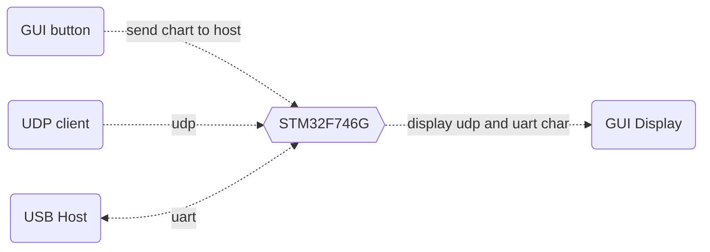

# stm32f746g-gui-lwip-and-uart6

The project run Gui, LWIP and USART6 at the time.

The message from UART display char on GUI. The button on GUI clicked will be send special chart to UART

```mermaid
graph LR

G1(GUI button)-.send chart to host.->S0{{STM32F746G}}
U0(UDP client)-.udp.->S0
U1(USB Host)<-.uart.->S0
S0-.display udp and uart char.->G2(GUI Display)

```
